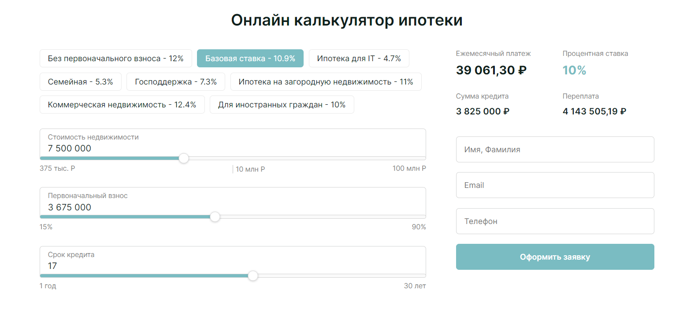

Онлайн калькулятор для расчёта ипотеки  
В проекте представлено несколько ипотечных ставок по различным условиям. Пользователь может выбрать стоимость недвижимости, первый взнос, а также срок кредитования. При изменение сумм, ежемесячный платёж будет автоматически пересчитываться. При выборе ставки кредитования и суммы, ежемесячный платёж высчитывается автоматически и клиет видит минимальный необходимый платёж из расчёта (min - 15%; max - 90%). Все суммы пользователь может как вводить, так и перетаскивать бегунок.  
При каждом изменении суммы в правом углу будет пересчитываться ежемесячный платёж, сумма кредитования и сумма переплаты.
Здесь также добавлена возможность подать заявку, а данные будут отправляться на указанную администратором страницу.  
Посмотреть онлайн: https://alinak96.github.io/MortgageCalculator/  

